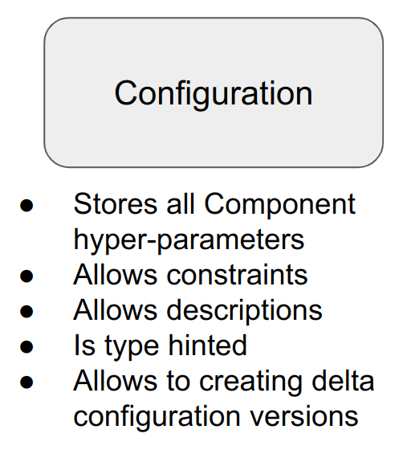

.. configuration

Definition
=============================================

A ``Configuration`` stores all the hyper-parameters of a ``Component``.

Each hyper-parameter is wrapped into a ``Parameter``.

Parameter
-----------------------------------------------

A ``Parameter`` is a useful wrapper for storing additional metadata like

- type hints
- textual descriptions
- allowed value range
- possible value variants
- optional tags for efficient ``Parameter`` search

For instance, the following code defines an integer ``Parameter`` with a specific allowed value range

.. code-block:: python

    x = Parameter(name='x', value=5, type_hint=int, allowed_range=lambda p: p in [1, 5, 10])

The ``name`` field is the ``Parameter`` unique identifier, just like a class field name.

The ``type_hint`` field inherently introduces a condition such that ``x`` can only store an integer value

The ``allowed_range`` field also introduces a condition such that ``x`` can only be set to ``1,5`` or ``10``.

In a ``Configuration``, the above code becomes

.. code-block:: python

    config.add(name='x', value=5, type_hint=int, allowed_range=lambda p: p in [1, 5, 10])

A ``Configuration`` is built just like a python dictionary. Thus, we can also instatiate a ``Configuration`` from a dictionary

.. code-block:: python

    config = Configuration({'x': 10})

.. note::

    Note that this method is not recommended since only ``name`` and ``value`` fields can be set.

Functionalities
=============================================

A ``Configuration`` can

- Add ``Parameter`` instances
- Add conditions relating one or multiple ``Parameter``
- Validate itself by running all its conditions to check for errors
- Support efficient ``Parameter`` search via tags
- Generate copies or delta copies of itself. A delta copy is a copy with some differences.
- Support ``Parameter`` inheritance since it is a Python class.
- Be specified via a template (``Configuration.get_default``): a readable and detailed specification.

Adding conditions
=============================================

Recall our data loader recurring example, we can define a more advanced ``DataLoaderConfig`` as follows:

.. code-block:: python

    class DataLoaderConfig(Configuration):

        @classmethod
        def get_default(
                cls
        ):
            config = super().get_default()

            config.add(name='samples_amount',
                       type_hint=int,
                       description="Number of samples to load")
            config.add(name='name',
                       type_hint=str,
                       description="Unique dataset identifier",
                       is_required=True)
            config.add(name='has_test_split_only',
                       value=False,
                       type_hint=bool,
                       description="Whether DataLoader has test split only or not")
            config.add(name='has_val_split',
                       value=True,
                       type_hint=bool,
                       description="Whether DataLoader has a val split or not")
            config.add(name='has_test_split',
                       value=True,
                       type_hint=bool,
                       description="Whether DataLoader has a test split or not")

            return config

Moreover, we can add some **conditions** as well

.. code-block:: python

    class DataLoaderConfig(Configuration):

        @classmethod
        def get_default(
                cls
        ):
            config = super().get_default()

            config.add(name='samples_amount',
                       type_hint=int,
                       description="Number of samples to load",
                       allowed_range=lambda p: p > 0)
            config.add(name='name',
                       type_hint=str,
                       description="Unique dataset identifier",
                       is_required=True)
            config.add(name='has_val_split',
                       value=True,
                       type_hint=bool,
                       description="Whether DataLoader has a val split or not")
            config.add(name='has_test_split',
                       value=True,
                       type_hint=bool,
                       description="Whether DataLoader has a test split or not")

            config.add_condition(name='at_least_one_split',
                                 condition=lambda c: c.has_val_split or c.has_test_split)

            return config

In this example, we have 6 **implicit** conditions and 1 **explicit** condition.

In particular, about the **implicit** conditions, we have:
    ``samples_amount``: ``type_hint`` and ``allowed_range`` conditions (total: 2 implicit conditions)

    ``name``: ``type_hint`` and ``is_required`` conditions (total: 2 implicit conditions)

    ``has_val_split``: ``type_hint`` condition (total: 1 implicit condition)

    ``has_test_split``: ``type_hint`` condition (total: 1 implicit condition)

Validating a Configuration
=============================================

All ``Configuration`` conditions are not executed automatically.

The ``Configuration.validate()`` method runs all conditions in sequence to check if the ``Configuration`` can be used.

In cinnamon, the validation of a ``Configuration`` is performed when building a ``Component`` via ``Registry.build_component(...)`` or ``Registry.build_component_from_key(...)``.

Getting a Configuration (delta) copy
=============================================

Configuration variants
=============================================

Nested Configurations
=============================================
